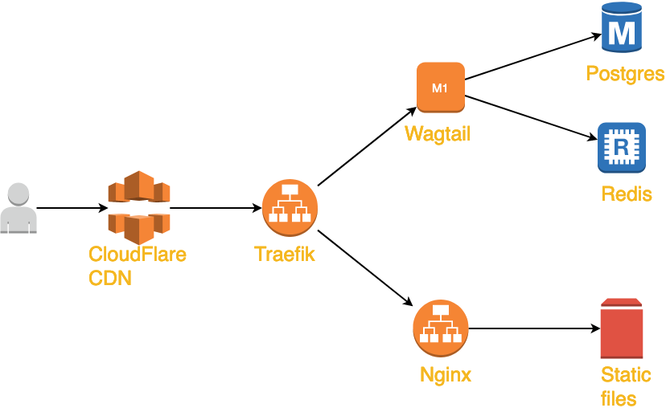

HanusoveDni.sk
==============

Webpage for "Hanus Days" - A unique social city academic festival offering a value programme at a point where Christianity meets today´s society!

## Basic info

**Backend:** Python 3 + Wagtail (Django)

**Frontend:** Sass, jQuery, Elm

**Monitoring:** [Status Page](https://stats.uptimerobot.com/A8xjNh98xx)

### Architecture

Project depends heavily on Cloudflare's CDN. Everything is stored and served from CDN, even html pages. Of course, except for admin interface. When a page is edited in admin, we clear CDN cache for it's url and all the dependent urls.

This gives us a great benefit - our servers handle less than 10% of traffic, everything else is served from CDN.

### Deployment
Deployment is done automatically with GitLab CI (check `.gitlab-ci.yml`). There are 2 stages:

1. New commits in master are automatically deployed to staging server.
    * Build new docker image
    * deploy image to server
    * clean CDN cache
2. After manual confirmation in Gitlab, production deployment starts
    * deploy image to server
    * clean CDN cache
   
All the secrets are stored in GitLab

### Backup
Backup is created once a week with GitLab CI/CD Schedules.

- DB dump is copied to Dropbox.

## How to start with development
1. Install docker and yarn
2. Install frontend packages with `yarn install` and 
   build docker images with `docker-compose build`
3. Create network: `docker network create hanus-net`

**Run backend:** `docker-compose up web`

**Run frontend:** `yarn run start`

**Build production frontend:** `yarn run prod`

**Bundle elm:**  `elm make src/Main.elm --optimize --output=elm-bundle.js`

Check wiki for more!
